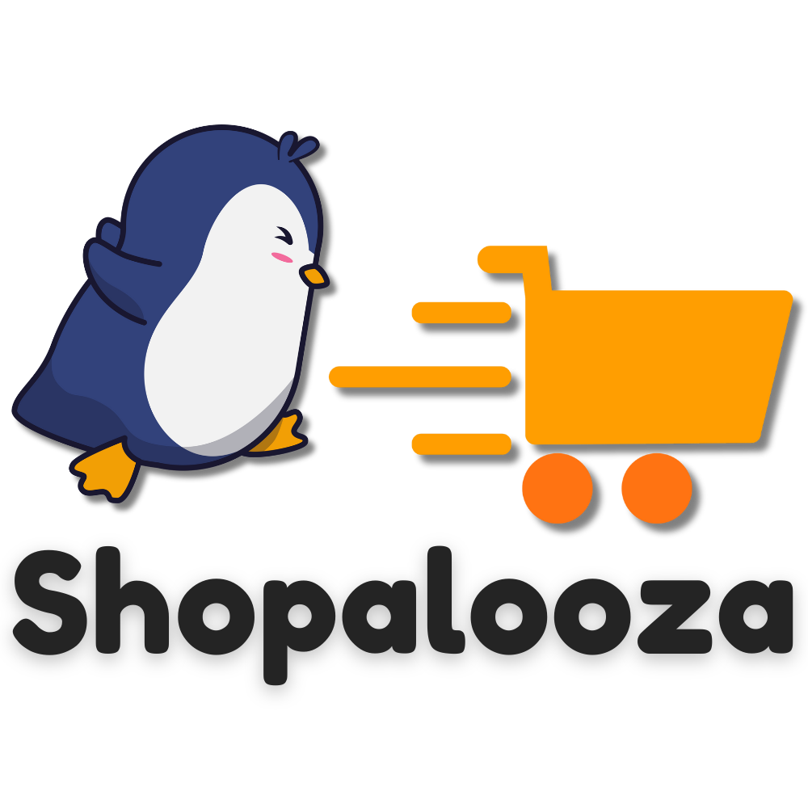
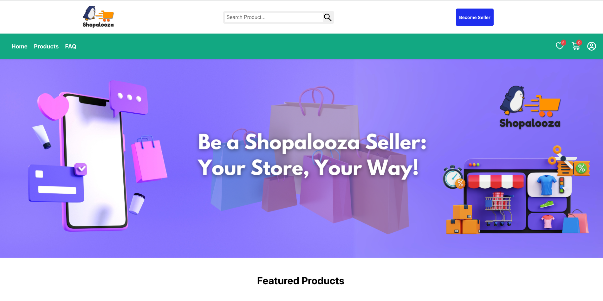

# Shopalooza
 
Welcome to **Shopalooza**, an e-commerce marketplace where users can buy products and become sellers to list their own products. This website offers a variety of features including secure login, adding items to the wishlist and cart, and searching for items.

## Features

- **Secure Authentication**: Users can securely sign up, log in, and log out.
- **Seller Accounts**: Users can register as sellers to list and manage their products.
- **Product Management**: Sellers can create, edit, and delete products.
- **Wishlist**: Users can add products to their wishlist for future reference.
- **Shopping Cart**: Users can add products to their shopping cart and proceed to checkout.
- **Search Functionality**: Users can search for products using keywords.
- **Responsive Design**: The website is optimized for desktop.

Visit Shopazoola here:
https://fe-mern-ecommerce.vercel.app/

## Technologies Used

- **Frontend**:
  - React.js
  - Redux
  - React Router
  - Axios
  - Material-UI
  - CSS

- **Backend**:
  - Node.js
  - Express.js
  - MongoDB
  - Mongoose
  - Cloudinary (for image uploads)
  - bcrypt (for password hashing)
  - JWT (for authentication)
  - multer (for handling file uploads)
